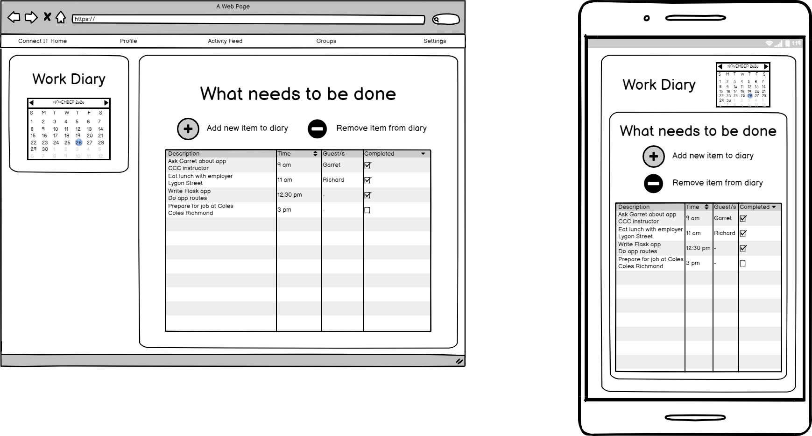

# Overview

My app is designed to be a LinkedIn site for IT professionals.
Similar to LinkedIn, IT professionals will be able to:
* create an account
* make posts and add photos of themselves
* write a bio and add work experience
* connect, follow and message other users
* list their skills, experience, education and add a link to their github account
* like and comment on other posts

Different from LinkedIn as of November, 2020, IT professionals will be able to:
* freely advertise themselves for freelance IT work
* join groups with people who have similar interests

Docs for my app:
* [Trello board](https://trello.com/b/7Y9qhmBJ/project-management)
* [Swagger editor yml](https://petstore.swagger.io/?url=https://raw.githubusercontent.com/mrixon95/Docs_On_Term3_CCC_course/main/LinkedIn%20App/connectITAPI.yaml)


# Wireframes

### Login page


### Profile page


### Activity Feed page


### Diary page


### Salary data page


### Settings page


### Entity Relationship diagram

* Each User can have multiple photos, posts, comments on posts, study qualifications, past work positions, certifications, resumes and projects and connections
* Each post can have many comments
* Each message has 2 users (one sending the message and one receiving the message)
* Each connection has 2 users (status is either pending or confirmed)


## Installation
In order to install this application:

Install python 3.8, python3.8-venv and python3-pip on your system.
On Ubuntu run ```sudo apt install python3.8 python3.8-venv```
Verify that it install successfully by running ```python3.8 --version```

Secondly install pip3 the python3 package manager.
On Ubuntu run ```sudo apt-get install python3-pip```
or ```python3 -m pip install pip```

Thirdly clone the application onto your system by running ```git clone https://github.com/mrixon95/Docs_On_Term3_CCC_course.git```
and cd into the directory

Fourthly download a virtual environment and activate it.
On Ubuntu run ```python3 -m venv venv``` to download the module
and ```source venv/bin/activate``` to activate the virtual environment.
.
Finally install application dependencies within the activated Python3.8 virtual environment by running ```pip3 install -r requirements.txt```.


## Setup
Create a .env file with the .env.example template within the src folder and populate the required fields within the .env file.

## Custom Commands
These following flask commands below are for automating tasks related to database tables and for testing during the development phase.
1. flask db create: creates database tables defined in registered models.
2. flask db seed: populates database tables with dummy data using faker module.
3. flask db drop: drops all database tables defined in registered models.

