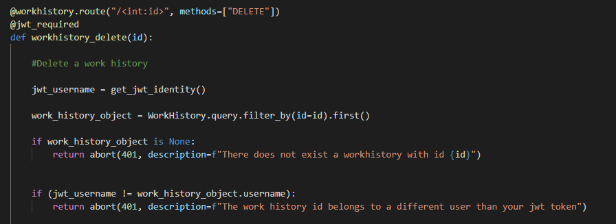
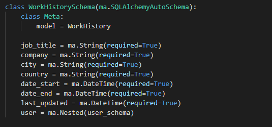
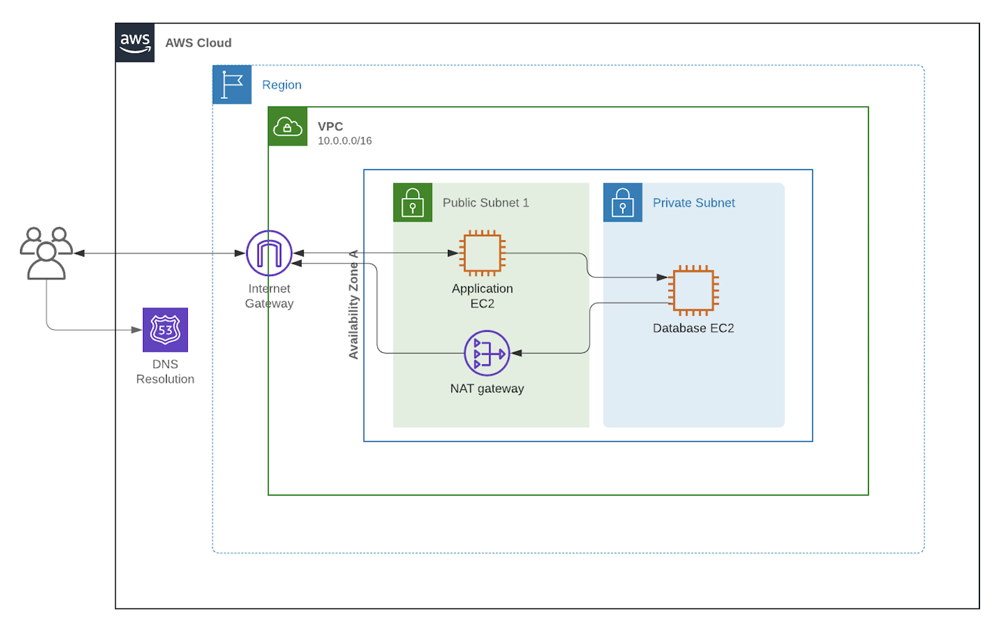

# Report 1: Privacy and Security Report

## Handling user data

Sensitive data like a user's email, phone number and password are collected and stored in a PostgreSQL database within an AWS EC2 instance. To ensure the original passwords do not get hacked, they are instead hashed using bcrypt (a slow hashing algorithm) and stored as that hashed version in the database. This hashing algorithm cannot be undone, meaning that the plain text password cannot be discovered by any hacker, even if they get access to the database. If they try a brute force attack by trying every conceivable password, the slow hashing algorithm will ensure that it cannot be done within a reasonable time frame. This mitigates the concern of users that their password may be discovered by a hacker.

## Authorization

Whenever a user tries to create, update or delete data, they are required to pass in a bearer token in the header of their HTTP request. This is because the data belongs to a particular user and therefore we need to check that the data does belong to the user. To check whether a particular bearer token belongs to a particular user, the `jwt_required` decorator is used in combination with the flask endpoint function.

The decorator ensures that a valid JWT token is in the header of the HTTP request. The function above gets the username from the JWT token and the gets work history object using the id passed in the request. If the `jwt_username` does not match up with the user who owns the `work_history_object,` then the user is not authorized to delete it. The request is aborted with a HTTP error code. The HTTP 401 Unauthorized client error status response code represents the request lacked valid authentication credentials.

The JWT token itself has an expiry of 1 day so that it needs to be renewed daily. Anyone hacker who gets a hold of the JWT token will only be able to use it for 1 day before it becomes invalid. 

### SQL Injections

The Flask app is set up with Object Relational Mapping (ORM) and Schema Validation Object Relational Mapping. These mappings enable the abstraction of the database connection by using a model class. This helps with security because there is **no direct connection** between the user and the database. Instead, users must use the endpoints made available in the controller directory. These controllers are used in the flask app to perform checks on user input data before any updates to the database are made. This can be seen above where checks are done to see if a work history with the given id does indeed exist.  Also the end point is made to only accepts integer ids. 

Furthermore, **schemas** are used to validate the input given by the user, these include validating the datatypes and checking that required fields are filled. The input from users must satisfy the schemas validations and all the checks in the controllers, before it can be used to query the database.  

Through the use of controllers and schemas, the API framework **sanitizes the user input** to ensure it only contains valid data.

## Secure Deployment

To ensure secure deployment, the application and the database can be deployed within a virtual private cloud, however the database should be within its own private subnet. Being in its own private subnet ensures that the database itself does not accept any incoming traffic from the internet. **The only incoming traffic the database should accept is from the flask application**. This ensures that the traffic must go through the controllers and pass all the validations within them, before it can query the database. On the other hand, the flask application itself must be in a public subnet so that its endpoints are publicly accessible to users.  

In addition, a cloud environment like AWS offers its own security measures. These include AWS Security Hub which gives a comprehensive view of security alerts related to the application, as well as tools such as firewalls and endpoint protection. AWS VPC Flow logs can monitor where the traffic is coming from and EC2 instances can restrict access to particular address ranges.

## Summary

The data in the Flask app must be secure since it stores sensitive user data. To ensure security, the Flask app authenticates users and authorizes them based on their credentials. The flask app implements password hashing to avoid storing passwords as plain test, schema validation to ensure valid user input and object relational mapping so that users don't have a direct connection to the database. Finally, the deployment of the database into a private subject in a VPC, ensures that it only accepts incoming traffic from the flask app. This way the public can't directly access the database.
