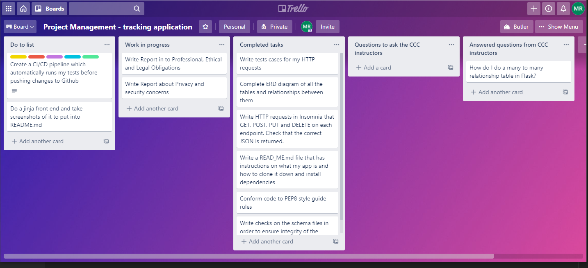

# Report in to Professional, Ethical and Legal Obligations 

### Professional Obligations

- **On-time deliver of project with thorough testing** 

  Launching new production code is often time-critical and other employees at an organization often rely on code being released on time without significant bugs. The code must be properly tested to ensure no bugs go to production

  For example, CyberPunk 2077 is a game released in late 2020 that was rife with bugs and glitches. Clearly the professional obligation of performing thorough testing was not completed and the game was later removed from the PlayStation store. 

  To ensure proper testing, valid, invalid and missing inputs were tested on each endpoint. Such inputs include a wrong password, an id that does exist, incorrect data types, duplicated fields and missing fields.

  To ensure that the project was completed on time, I created a Trello board which outlined the tasks to do, work in progress and completed tasks. This aided me in remembering what work I had to complete before the due date and gave me an overview of the progress I made thus far. Below is a screen capture I took when writing my reports. It was taken before I did my jinja front end and after I had written test cases for my flask app.

  

### Trello board

- **Project Maintenance**

To maintain my flask app, I have written a **CI/CD pipeline** in a .yml file within my flask app. As part of this pipeline, all changes pushed to GitHub will need to firstly run on one of GitHub's VMs using the latest Ubuntu operating system. The VM installs python3.8 and installs the dependencies. The automated tests in the tests directory are ran. If any tests fails then the developer will be made aware of what failure or error occurred and the code will not be deployed to production. These tests ensure that **no bugs checked by a test can get into production**, meaning that the project is well maintained. 

Additionally, as part of my pipeline my code is checked to ensure it conforms to **PEP8 convention**. This helps **maintain the readability** of the Python code. Readability is important for project maintenance because in the future you will inevitably forget what some of your code does and why you wrote it. Also someone else may want to collaborate on your project and may need to read your code. If it follows PEP8 convention, it will be readable.

Finally I use the **Flask-Migrate** library to migrate all existing data into changes made to the database. In the future, it is very probable that changes to tables will need to be made eg. Users being able to upgrade to premium. This would involve adding a new column to users to say whether they are premium or not. The Flask Migrate functions automatically detect any differences between the tables in the current database and the tables in the database when the command was last executed. The Flask-Migrate module stores the upgrade function needed to change the database from the previous to the current state it is in. Most critically, it ensures that the **current data is maintained**. This is important because we do not want to lose any data when making changes to our tables.

## Ethical Obligations

My flask application conforms with the ethical codes of conduct approved by industry, namely:

1. **Ensuring security and acknowledge vulnerabilities.**

   The code is implemented with the aim of ensuring security. For example, **passwords are hashed** using bcrypt so that no one can know what the user's plan text password was. More analysis of security is in the report 1 and there are acknowledgements on what vulnerabilities exist in the flask application. Additionally, advice is given to the user on how to manage security risks.

2. **Competence**

   The project was done to the bests of the developer's ability. A trello board was used to manage the tasks required to complete the Flask Application with a high level of professionalism. In addition, tests have been run on the application to find any bugs and ensure that any changes to code do not produce those bugs. 

## Legal Obligations

If a business owned this application, the application would be subject to the **1988 privacy act**. In this legislation, it states that private and public organizations can only use people's information for the intended purpose, unless there is an exemption. On the flask app, it stores the user's name, email and phone number. It would therefore be **illegal** to take the user's data and sell it off to another organisation. However, if the individual user expresses consent to disclosure of their data then it would become legal.

In addition, there are legal obligations surrounding security breaches. When there is a security breach, the privacy act states that an entity needs to "take reasonable steps either to notify the individual of certain matters or to ensure the individual is aware of those matters". Moreover, entities must notify affected individuals when they are at risk of serious harm as a result of the breach.   Therefore, if sensitive user data in the Flask app was stolen, it is the legal obligation of the owner of the Flask app to notify all the users affected.

A potential legal obligation could be ensuring that the posts on the application do not contain violent, crude or hateful content. If the application does contain such unacceptable content, there should be a terms and conditions document that users must accept before logging into the application. Moreover, any unacceptable content should be found and deleted promptly from the application.

Finally, if the Flask App were to contain credit card details in the future, it would need to be compliant with the Payment Card Industry Date Security Standard (PCI DSS) to ensure the credit card information remains secure. The security process encompasses prevention, detection and how to react to security incidents. It is important to comply because it improves the trust your customers have with holding their sensitive payment card information. Also it prevent security breaches and data theft, which cost time and money to investigate.

The 12 requirements are

- Use and maintain firewalls

- Proper password protections

- Protect cardholder data

- Encrypt transmitted data

- Use and maintain anti-virus

- Properly updated software

- Restrict data access

- Unique IDs for access

- Restrict physical access

- Create and maintain access logs

- Scan and test for vulnerabilities

- Document Policies

  Reference: What is PCI Compliance? Published September 29, 2020. Accessed January 2, 2021: https://digitalguardian.com/blog/what-pci-compliance